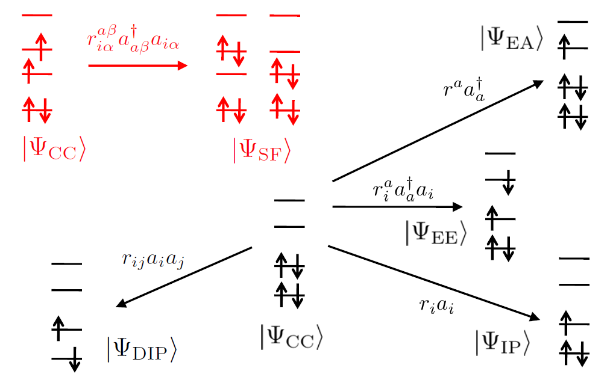

# Couple Cluster theory

## Ground state

The CC wavefunction can be written as:
$$
    \Psi_{\text{CC}} = e^T |\Phi_0\rangle
$$

The cluster operator $T$ can be expressed as:
$$
    T = T_1 + T_2 + T_3 + \dots
$$

where the $T_n$ operator is defined as:

$$
    T_n = \frac{1}{n!^2}\sum t_{ijk\dots}^{abc\dots} a^\dagger ib^\dagger jc^\dagger k\dots
$$

For example, the single excitation operator $T_1$ is defined as:

$$
    T_1 = \sum_{ia} t_i^a a^\dagger i
$$

and the double excitation operator $T_2$ is defined as:

$$
    T_2 = \frac{1}{4}\sum_{ijab} t_{ij}^{ab} a^\dagger ib^\dagger j
$$

The exponential operator $e^T$ can be expanded as:

$$
\begin{aligned}
    e^T  = & 1 + T + \frac{1}{2}T^2 + \frac{1}{3!}T^3 + \dots \\
      = & 1 + T_1 + T_2 + \dots \\
     & + \frac{1}{2}T_1^2 + T_1T_2 + \frac{1}{2}T_2^2 + \dots \\
     & + \frac{1}{3!}T_1^3 + \frac{1}{2}T_1^2T_2 + \frac{1}{2}T_1T_2^2 + \frac{1}{3!}T_2^3 + \dots
\end{aligned}
$$

The single excitation can be expressed as:

$$
    \Phi_1 = T_1 |\Phi_0\rangle
$$

and the double excitation can be expressed as:

$$
    \Phi_2 = (T_2 + \frac{1}{2}T_1^2 )|\Phi_0\rangle
$$

Return to the Schrödinger equation, we can obtain that:

$$
    \hat{H} \Psi_\text{CC} = \hat{H} e^T |\Phi_0\rangle = E e^T |\Phi_0\rangle
$$

Multiplying the equation by $e^{-T}$ from the left, we can obtain:

$$
    e^{-T} \hat{H} e^T |\Phi_0\rangle = E |\Phi_0\rangle
$$

We introduce the effective Hamiltonian (similarity transformed Hamiltonian):

$$
    \bar{H} = e^{-T}H e^T
$$

Therefore, the equation can be rewritten as:

$$
    \bar{H} |\Phi_0\rangle = E |\Phi_0\rangle
$$

By projecting onto excitation determinants, we can obtain:

$$
    \langle \Phi_{ij\dots}^{ab\dots} | \bar{H} | \Phi_0 \rangle = 0
$$

where $\Phi_{ij\dots}^{ab\dots}$ is the excitation determinant.

The ground state energy can be expressed as:

$$
    E_{\text{CC}} = \langle \Phi_0 | \bar{H} | \Phi_0 \rangle
$$

The electronic Hamiltonian operator can be expressed as:
$$
    \hat{H} = E_{\text{HF}} +  \sum_{pq} F_{pq} p^\dagger q + \frac{1}{4} \sum_{pqrs} \langle pq||rs \rangle p^\dagger q^\dagger s r
$$

There are four terms in the one electron operator: OO, OV, VO, and VV. For the two-electron operator, there are 9 distinct terms: OOOO, OOOV, OVOO, OOVV, VVOO, OVOV, VOVV, VVVO, VVVV.

The effective Hamiltonian can be rewritten using Baker-Campbell-Hausdorff formula as:

$$
\begin{aligned}
    \bar{H} = & \hat{H} + \left[\hat{H}, T\right] + \frac{1}{2!}\left[\left[\hat{H}, T\right], T\right] + \dots  \\
    = & \hat{H} + \left[\hat{H}, T_1\right] + \left[\hat{H}, T_2\right] + \frac{1}{2}\left[\left[\hat{H}, T_1\right], T_1\right] \\
    & + \frac{1}{2}\left[\left[\hat{H}, T_2\right], T_2\right] + \left[\left[\hat{H}, T_1\right], T_2\right] + \dots
\end{aligned}
$$

knowing that:

$$
\begin{aligned}
    \left[\left[\hat{H}, T_1\right], T_2\right]  = \left[\left[\hat{H}, T_2\right], T_1\right]
\end{aligned}
$$

Only the single and double cluster amplitudes contribute to the CC energy (that means only consider the contribution of single and double), and therefore the energy can be expressed as:

$$
\begin{aligned}
     E_{\text{CC}} & =  \langle \Phi_0 | \bar{H} |\Phi_0 \rangle \\
    & = \langle \Phi_0 | \hat{H} | \Phi_0 \rangle + \sum_{ia} F_{ia} t_i^a + \frac{1}{2} \sum_{ijab} \langle ij||ab \rangle t_{i}^{a} t_{j}^{b} + \frac{1}{4} \sum_{ijab} \langle ij||ab \rangle t_{ij}^{ab} \\
    & = E_{\text{HF}} + \sum_{ia} F_{ia} t_i^a + \frac{1}{4} \sum_{ijab} \langle ij||ab \rangle(t_{ij}^{ab}+t_{i}^{a} t_{j}^{b} -t_{i}^{b} t_{j}^{a} )
\end{aligned}
$$

where $F_{ia}$ is the Fock matrix element, and $\langle ij||ab \rangle$ is the two-electron integral.
The $\langle \Phi_0 | \hat{H} | \Phi_0 \rangle$ equals to the Hartree-Fock energy $E_{\text{HF}}$.

### CCSD

In CCSD, the cluster operator is truncated at the single and double excitation level:

$$
    T = T_1 + T_2
$$

and the wavefunction can be expressed as:

$$
    |\Psi_{\text{CCSD}} \rangle = e^{T_1+T_2} |\Phi_0\rangle
$$

Projecting onto singly and doubly excited determinants, we can obtain:

$$
    \langle \Phi_{i}^{a} | e^{-T_1}\hat{H}e^{T_1} + \left[e^{-T_1}\hat{H}e^{T_1}, T_2\right] | \Phi_0 \rangle = 0
$$

$$
\begin{aligned}
    & \langle \Phi_{ij}^{ab} | e^{-T_2-T_1}\hat{H}e^{T_1+T_2} | \Phi_0 \rangle 
    = \langle \Phi_{ij}^{ab} | e^{-T_2}e^{-T_1}\hat{H}e^{T_1}e^{T_2} | \Phi_0 \rangle 
    \\
    & = \langle \Phi_{ij}^{ab} | e^{-T_1}\hat{H}e^{T_1} + \left[e^{-T_1}\hat{H}e^{T_1}, T_2\right] + \frac{1}{2}\left[\left[e^{-T_1}\hat{H}e^{T_1}, T_2\right], T_2\right] | \Phi_0 \rangle = 0
\end{aligned}
$$

The energy can be expressed as:

$$
    E_{\text{CCSD}} = \sum_a\sum_i t_i^a f_{ia} + \frac{1}{4} \sum_{ab}\sum_{ij}\tau_{ij}^{ab} \langle ij||ab \rangle
$$

### CC2

In the CC2 method, the projection onto the singly excited determinant
is the same as the CCSD method:
$$
    \langle \Phi_{i}^{a} | e^{-T_1}\hat{H}e^{T_1} + \left[e^{-T_1}\hat{H}e^{T_1}, T_2\right] | \Phi_0 \rangle = 0
$$

and the projection onto the doubly excited determinant is:

$$
    \langle \Phi_{ij}^{ab} | e^{-T_1}\hat{H}e^{T_1} + \left[F, T_2\right] | \Phi_0 \rangle = 0
$$

## EOM-CC

### EOM-EE (Electronically Excited States)

Excited state can be expressed as:
$$
    |\Psi_{\text{ex}}\rangle = \mathbf{R} |\Phi_\text{g}\rangle
$$
where $|\Psi_{\text{ex}}\rangle$ is the excited state, and $|\Phi_\text{g}\rangle$ is the ground state.
$\mathbf{R}$ is the excitation operator, which can be expressed as:
$$
    \mathbf{R} = \sum_{n} \mathbf{R}_n
$$

$$
    \mathbf{R}_n = \frac{1}{n!^2}\sum r_{ijk\dots}^{abc\dots} a^\dagger ib^\dagger jc^\dagger k\dots
$$

The ground state is approximated by:

$$
    |\Phi_\text{g}\rangle = e^T |\Phi_0\rangle
$$

where $|\Phi_0\rangle$ is an arbitrary Slater determinant, usually SCF solution.

Therefore, the excited state can be expressed as:

$$
    |\Psi_{\text{ex}}\rangle =\mathbf{R} e^T  |\Phi_0\rangle = e^T \mathbf{R} |\Phi_0\rangle
$$

which means the right excitation operator $\mathbf{R}$ and the cluster operator $T$ are commutative.

Inserting the equation into the Schrödinger equation, we can obtain:

$$
    H \mathbf{R} e^T  |\Phi_0\rangle = E_\text{ex} \mathbf{R} e^T  |\Phi_0\rangle
$$

The $T$ operator and $\mathbf{R}$ operator are necessarily commutative, so we can rewrite the equation
using the effective Hamiltonian operator $\bar{H}= e^{-T}H e^T$:

$$
    e^{-T}H e^T \mathbf{R}  |\Phi_0\rangle = \bar{H} \mathbf{R} |\Phi_0\rangle =
     E_\text{ex}  \mathbf{R}  |\Phi_0\rangle
$$

and then we can obtain the equation:

$$
   (\bar{H}-E_\text{ex}) \mathbf{R}  |\Phi_0\rangle = 0
$$

The goal of any EOM-CC calculation is to determine the energy difference between the initial and target states:

$$
\omega_k = E_k - E_{\text{CC}}
$$

With the commutation relation between the cluster operator $T$ and the excitation operator $\mathbf{R}$, we can obtain the EOM-CC equation:

$$
[\bar{H},\mathbf{R}]|\Phi_0\rangle = \omega_k \mathbf{R}|\Phi_0\rangle
$$

The effective Hamiltonian can be expressed in spin-orbital basis as:

$$
    \bar{H} = \sum_{pq} \mathbf{F}_{pq} a^\dagger_p a_q + \frac{1}{4} \sum_{pqrs} \mathbf{W}_{pqsr} a^\dagger_p a^\dagger_q a_s a_r
$$

Note that the CC wave operator $e^T$ is not unitary, so the effective Hamiltonian $\bar{H}$ is not Hermitian. As a result, each root of $\bar{H}$ is associated with two eigenvectors, which are the left and right eigenvectors. The left eigenvector is defined as:

$$
    \langle \tilde{\Psi} | = \langle \Psi_L | =
    \langle \Phi_0 | \mathbf{L} e^{-T}
$$

and the right eigenvector is defined as:

$$
    | \Psi \rangle = | \Psi_R \rangle =
    e^T \mathbf{R} |\Phi_0 \rangle
$$

Note that the left deexcitation operator $\mathbf{L}$ is not commutative with the cluster operator $T$. The left eigenfunction is defined as:

$$
\langle \Psi_0 | \mathbf{L}\bar{H} = \langle \Phi_0 | \mathbf{L}\omega_k
$$

The left de-excitation operator $\mathbf{L}$ can be expressed as:

$$
    \mathbf{L} = \sum_{n} \mathbf{L}_n
$$

$$
    \mathbf{L}_n = \frac{1}{n!^2}\sum l_{abc\dots}^{ijk\dots} i^\dagger aj^\dagger bk^\dagger c\dots
$$

The left and right operators satisfy the biorthogonality condition:

$$
    \langle \mathbf{L}_i | \mathbf{R}_j \rangle = \delta_{ij}
$$

The two sets of solutions satisfy the biorthogonality condition:

$$
    \langle \tilde{\Psi}^{(i)} | \Psi^{(j)} \rangle = 1
$$

If the C is unity, we can rewrite the equation as:

$$
    \langle \tilde{\Psi} | \Psi \rangle = 1
$$

and therefore the energy can be expressed as:

$$
    E = \langle \tilde{\Psi} | H | \Psi \rangle =
    \langle \Phi_0 |\mathbf{L} \bar{H} \mathbf{R}| \Phi_0 \rangle
$$

Note that for ground state, we have $\mathbf{L} = \mathbf{R} = 1$, so the energy can be expressed as:

$$
    E_{\text{CC}} = \langle \Phi_0 | \bar{H} | \Phi_0 \rangle
$$

The eigenvalues can be obtained by diagonalizing the matrix $\mathbf{A}$ in the basis of the reference, single excited and doubly excited determinants. The Jacobian matrix can be expressed as:

$$
\mathbf{A} = 
\begin{pmatrix}
\langle\Phi_i^a|[\tilde{H}+[\tilde{H},T_2],\{c^\dagger k\} ]| \Phi_0\rangle &  \langle\Phi_i^a|[\tilde{H},\{c^\dagger d^\dagger kl\} ]| \Phi_0\rangle \\
\langle\Phi_{ij}^{ab}|[\tilde{H}+[\tilde{H},T_2],\{c^\dagger k\}] | \Phi_0\rangle &  \langle\Phi_{ij}^{ab}|\tilde{H}+[\tilde{H},T_2],\{c^\dagger d^\dagger kl\} | \Phi_0\rangle
\end{pmatrix}
$$

For CC2, the Jacobian matrix can be expressed as:

$$
\mathbf{A} = 
\begin{pmatrix}
\langle\Phi_i^a|[\tilde{H}+[\tilde{H},T_2],\{c^\dagger k\} ]| \Phi_0\rangle &  \langle\Phi_i^a|[\tilde{H},\{c^\dagger d^\dagger kl\} ]| \Phi_0\rangle \\
\langle\Phi_{ij}^{ab}|[\tilde{H},\{c^\dagger k\}] | \Phi_0\rangle &  \langle\Phi_{ij}^{ab}|F,\{c^\dagger d^\dagger kl\} | \Phi_0\rangle
\end{pmatrix}
$$

And the whole eigenfunction can be expressed as:

$$
\mathbf{A} 
\begin{pmatrix}
R_1 \\ R_2
\end{pmatrix}
= \omega 
\begin{pmatrix}
R_1 \\ R_2
\end{pmatrix}
$$

$$
\begin{pmatrix}
L_1 & L_2
\end{pmatrix}
\mathbf{A} 
= \begin{pmatrix}
L_1 & L_2
\end{pmatrix}\omega 
$$

Then, the right and left eigenfunctions can be expressed as:

$$
\sum_{kc}\langle\Phi_i^a|[\tilde{H}+[\tilde{H},T_2],\{c^\dagger k\} ]| \Phi_0\rangle r_k^c + \sum_{klcd} \langle\Phi_i^a|[\tilde{H},\{c^\dagger d^\dagger kl\} ]| \Phi_0\rangle r_{kl}^{cd} = \omega r_i^a
$$

$$
\sum_{kc}\langle\Phi_{ij}^{ab}|[\tilde{H}+[\tilde{H},T_2],\{c^\dagger k\}] | \Phi_0\rangle r_k^c + \sum_{klcd} \langle\Phi_{ij}^{ab}|\tilde{H}+[\tilde{H},T_2],\{c^\dagger d^\dagger kl\} | \Phi_0\rangle = \omega r_{ij}^{ab}
$$

$$
\sum_{ia}l_a^i \langle\Phi_i^a|[\tilde{H}+[\tilde{H},T_2],\{c^\dagger k\} ]| \Phi_0\rangle + \sum_{ijab} l_{ij}^{ab} 
\langle\Phi_{ij}^{ab}|[\tilde{H}+[\tilde{H},T_2],\{c^\dagger k\}] | \Phi_0\rangle = \omega l_k^c
$$

$$
 \sum_{ia}l_a^i\langle\Phi_i^a|[\tilde{H},\{c^\dagger d^\dagger kl\} ]| \Phi_0\rangle + \sum_{ijab} l_{ij}^{ab} 
\langle\Phi_{ij}^{ab}|\tilde{H}+[\tilde{H},T_2],\{c^\dagger d^\dagger kl\} | \Phi_0\rangle = \omega l_{kl}^{cd}
$$

### EOM-EA (Electron Attachment)

For EOM-EA state, the right excitation operator $\mathbf{R}$ is defined as:

$$
    \mathbf{R}^{\text{EA}} = \sum_{a} r_a a^\dagger + \frac{1}{2} \sum_{iab} r_{i}^{ab} ia^\dagger b^\dagger + \cdots
$$

### EOM-IP (Ionization Potential)

For EOM-IP state, the right excitation operator $\mathbf{R}$ is defined as:

$$
    \mathbf{R}^{\text{IP}} = \sum_{i} r_i i + \frac{1}{2} \sum_{ija} r_{ij}^{a} ija^\dagger + \cdots
$$

### EOM-SF (Spin-Flip)

For EOM-SF state, the right excitation operator $\mathbf{R}$ is defined as:

$$
    \mathbf{R}_{M_s=-1} \equiv \mathbf{R}^{\text{IP}} = \sum_{ia}r_i^aa_\beta^\dagger i_\alpha + \frac{1}{2}\sum_{ijab}r_{ij}^{ab}a_\beta^\dagger i_\alpha b_\sigma^\dagger j_\sigma + \cdots
$$

where $\sigma=\alpha$ or $\beta$.

## Derivative

### General

The asymmetrized, perturbation-independent, deexcitation operator
$\Lambda$ can be expressed as:

$$
\begin{aligned}
& \Lambda = \sum_{n} \Lambda_n \\
& \Lambda_1 = \sum_{ia} \lambda_i^a i^\dagger a \\
& \Lambda_2 = \frac{1}{4}\sum_{ijab} \lambda_{ij}^{ab} a_i^\dagger a_j^\dagger a_b a_a \\
& \Lambda_n = \frac{1}{n!^2}\sum \lambda_{abc\dots}^{ijk\dots} i^\dagger aj^\dagger bk^\dagger c\dots
\end{aligned}
$$

The $\lambda$ amplitude satisfies the condition:

$$
    \langle \Phi_0 | \Lambda | \Phi \rangle
    = - \langle \Phi_0 | (H_Ne^T)_c | \Phi \rangle
    \langle \Phi | (H_Ne^T)_c - \Delta E| \Phi \rangle ^{-1}
$$

Therefore, we have:

$$
    \langle \Phi_0 | (H_N^\xi e^T)_c | \Phi_0 \rangle + \langle \Phi_0 | \Lambda | \Phi \rangle \langle \Phi | (H_N^\xi e^T)_c | \Phi_0 \rangle  = \Delta E^\xi
$$

Finally the derivative of the energy can be expressed as:

$$
\begin{aligned}
    \Delta E^\xi = & \mathbf{D}_{ij}f_{ij}^\xi + \mathbf{D}_{ab}f_{ab}^\xi + \sum_{pqrs}\Gamma(pq,rs) \langle pq||rs \rangle^\xi \\
    = & \mathbf{D}_{ij}f_{ij}^\xi + \mathbf{D}_{ab}f_{ab}^\xi  \\
   & + \Gamma(ij,ab)\langle ij||ab\rangle^\xi
    + \Gamma(ab,cd)\langle ab||cd\rangle^\xi   \\
   & + \Gamma(kl,ij)\langle kl||ij\rangle^\xi
    + \Gamma(ja,bi)\langle ja||bi\rangle^\xi   \\
   & + \Gamma(ai,bc)\langle ai||bc\rangle^\xi
    + \Gamma(jk,ia)\langle jk||ia\rangle^\xi   \\
\end{aligned}
$$

where the $D_{pq}$ is the relaxed density matrix, and the $\Gamma_{pq,rs}$ is the effective density matrix.

### CCSD Derivative

The CCSD gradient can be expressed as:

$$
    \frac{\partial E_{\text{CCSD}}}{\partial \xi} =
\sum_{pq} D_{pq}f_{pq}^{(\xi)} + \sum_{pqrs}\Gamma(pq,rs) \langle pq||rs \rangle^\xi
+ \sum_{pq}I_{pq}S_{pq}^{\xi}
$$

### EOM-CC Derivative

The derivative of the EOM-CC energy can be expressed as:

$$
    \frac{\partial E_{\text{EOM-CC}}}{\partial \xi} =
D_{pq}f_{pq}^{(\xi)} + \frac{1}{4}\Gamma_{pqrs} \langle pq||rs \rangle^\xi
+ I_{pq}S_{pq}^{\xi}
$$

where:
overlap derivative:
$$
S_{pq}^{\xi} = c_{\mu p} \frac{\partial S_{\mu\nu}}{\partial \xi} c_{\nu q}
= c_{\mu p} c_{\nu q} \left( \langle \frac{\partial\chi_\mu}{\partial\xi}|\chi_\nu \rangle + \langle \chi_\mu|\frac{\partial\chi_\nu}{\partial\xi} \rangle \right)
$$

ERI derivative:
$$
\langle pq||rs \rangle^\xi = c_{\mu p} c_{\nu q} c_{\lambda r} c_{\sigma s} \frac{\partial \langle \mu\lambda||\nu\sigma \rangle}{\partial \xi}
$$

$$
\phi_p = c_{\mu p} \xi_{\mu}
$$

Fock matrix derivative:
$$
f_{pq}^{(\xi)} = c_{\mu p}c_{\nu q} \left(\frac{\partial h_{\mu\nu}}{\partial\xi}+ c_{\lambda i}c_{\sigma i}\frac{\partial\langle \mu\lambda||\nu\sigma \rangle}{\partial\xi} \right)
= h_{pq}^\xi + \sum_{m} \langle pm||qm \rangle^\xi
$$

Derivative of the MO coefficients:

$$
\frac{\partial c_{\mu p}}{\partial \xi} = \sum_q U_{qp}^\xi c_{\mu q}
$$

where $U_{qp}^\xi$ is the CPHF coefficient.

Relaxed density matrix:
$$
D_{pq} = \gamma_{pq} + z_{pq}
$$

Effective density matrix:

$$
\gamma_{pq} = \langle \Phi_0 | \mathbf{L}[p^\dagger qe^T]_c\mathbf{R} |\Phi_0 \rangle
+ \langle \Phi_0 | \mathcal{Z}[p^\dagger qe^T]_c|\Phi_0 \rangle
$$

$$
\Gamma_{pqrs}
= \langle \Phi_0 | \mathbf{L}[p^\dagger q^\dagger sr e^T]_c\mathbf{R} |\Phi_0 \rangle
+ \langle \Phi_0 | \mathcal{Z}[p^\dagger q^\dagger sr e^T]_c|\Phi_0 \rangle
$$

where $c$ indicates the limitation to connected diagrams.

Auxiliary deexcitation operator $\mathcal{Z}$:

$$
\mathcal{Z} = \sum_{n} \mathcal{Z}_n
$$

$$
\mathcal{Z}_n = \frac{1}{n!^2}\sum \zeta_{abc\dots}^{ijk\dots} i^\dagger aj^\dagger bk^\dagger c\dots
$$

### Lagrangian of EOM-CC derivative

The EOM energy can be expressed as:

The full energy derivative can be expressed as:

$$
\frac{\mathrm{d} E }{\mathrm{d} \xi} = \frac{\partial E}{\partial \xi} +
\frac{\partial E}{\partial L}\frac{\partial L}{\partial \xi} + \frac{\partial E}{\partial R}\frac{\partial R}{\partial \xi} +
\frac{\partial E}{\partial T}\frac{\partial T}{\partial \xi} + \frac{\partial E}{\partial C}\frac{\partial C}{\partial \xi}
$$

The first term is the Hellmann-Feynman contribution:

$$
\begin{aligned}
& \frac{\partial E}{\partial \xi} =  \sum_{pq} h_{pq}^\xi \gamma_{pq}' + \frac{1}{4}\sum_{pqrs}\langle pq||rs \rangle^\xi \Gamma_{pqrs}' 
\\
& h_{pq}^\xi = \frac{\partial h_{pq}}{\partial \xi} = \sum_{\mu\nu}C_{\mu p}h_{\mu\nu}^\xi C_{\nu q} 
\\
& h_{\mu\nu}^\xi = \langle \chi_\mu | \frac{\partial \hat{h}}{\partial \xi} | \chi_\nu \rangle + \langle \frac{\partial \chi_\mu}{\partial\xi} | \hat{h} | \chi_\nu \rangle + \langle \chi_\mu | \hat{h} | \frac{\partial \chi_\nu}{\partial\xi} \rangle
\\
& \langle pq||rs \rangle^\xi = \frac{\partial \langle pq||rs \rangle}{\partial \xi} = \sum_{\mu\nu\lambda\sigma}C_{\mu p}C_{\nu q}\langle \chi_\mu\chi_\nu||\chi_\lambda\chi_\sigma \rangle^\xi C_{\lambda r}C_{\sigma s} \\
\end{aligned}
$$

$$
\begin{aligned}
\langle \chi_\mu\chi_\nu||\chi_\lambda\chi_\sigma \rangle^\xi = &
\langle \frac{\partial \chi_\mu}{\partial\xi}\chi_\nu||\chi_\lambda\chi_\sigma \rangle +
\langle \chi_\mu\frac{\partial \chi_\nu}{\partial\xi}||\chi_\lambda\chi_\sigma \rangle  
\\
& + \langle \chi_\mu\chi_\nu||\frac{\partial \chi_\lambda}{\partial\xi}\chi_\sigma \rangle +
\langle \chi_\mu\chi_\nu||\chi_\lambda\frac{\partial \chi_\sigma}{\partial\xi} \rangle
\end{aligned}
$$

The EOM energy is stationary with respect to the left and right eigenvectors, 
so the second and third terms are zero:

$$
\frac{\partial E}{\partial L} = \frac{\partial E}{\partial R} = 0
$$

Then there is so-called amplitude response $\frac{\partial E}{\partial T}$ 
 and orbital response $\frac{\partial E}{\partial C}$.

The Lagrangian derivative can be expressed as:

$$
\begin{aligned}
\frac{\partial \mathcal{L}(L, R, T, C,Z, \Lambda, \Omega)}{\partial \xi} = & 
\langle \Phi_0 Le^{-T} | \frac{\partial H}{\partial\xi} | e^TR\Phi_0 \rangle 
\\
+ & \langle \Phi_0 Ze^{-T} | \frac{\partial H}{\partial\xi} | e^T\Phi_0 \rangle 
\\ 
+ & \frac{1}{2}\sum_{pq}\lambda_{pq}\frac{\partial f_{pq}}{\partial\xi} + 
\sum_{pq}\omega_{pq}\frac{\partial S_{pq}}{\partial\xi}
\\
= & \sum_{pq}h_{pq}^\xi\rho_{pq} + \frac{1}{4}\sum_{pqrs}\langle pq||rs \rangle^\xi \Pi_{pqrs} \\
+ & \sum_{pq}\omega_{pq}S_{pq}^{\xi}
\end{aligned}
$$

The effective density matrices $\rho$ and $\Pi$ can be expressed as:

$$
\begin{aligned}
& \rho = \gamma' + \gamma'' + \gamma'''
\\
& \Pi = \Gamma' + \Gamma'' + \Gamma'''
\end{aligned}
$$

where the $\gamma'$ and $\Gamma'$ are the so-called non-relaxed density matrices:

$$
\begin{aligned}
& \gamma' = \frac{1}{2}\langle \Psi_L | p^\dagger q+q^\dagger p |\Psi_R \rangle
\\
& \Gamma' = \frac{1}{2}\langle \Psi_L | p^\dagger q^\dagger sr + s^\dagger r^\dagger pq |\Psi_R \rangle
\end{aligned}
$$

and $\gamma''$ and $\Gamma''$ are amplitude response contributions:

$$
\begin{aligned}
& \gamma'' = \frac{1}{2}\langle \Phi_0Ze^{-T} | p^\dagger q+q^\dagger p |e^T\Phi_0 \rangle
\\
& \Gamma'' = \frac{1}{2}\langle \Phi_0Ze^{-T} | p^\dagger q^\dagger sr + s^\dagger r^\dagger pq |e^T\Phi_0 \rangle
\end{aligned}
$$

and $\gamma'''$ and $\Gamma'''$ are orbital response contributions. $\gamma'''$
is related to the Lagrange multiplier $\lambda$, and $\Gamma'''$ is related to 
$\gamma'''$ and $\delta$.

## Properties

### Dipole Moment

The dipole moment of the reference state can be expressed as:

$$
\mu = \langle \Phi_0 | (1+\Lambda)e^{-T}\hat{\mu}e^T  | \Phi_0 \rangle
$$

and the EOM state dipole moment can be expressed as:

$$
\mu = \langle \Phi_0 | \mathbf{L}e^{-T}\hat{\mu}e^T\mathbf{R}  | \Phi_0 \rangle
$$

The density matrix for reference state can be expressed as:

$$
d_{pq} = \langle \Phi_0 | (1+\Lambda)e^{-T} p^\dagger qe^T  | \Phi_0 \rangle
$$

### Transition Dipole Moment

The transition dipole moment from ground state to EOM state k can be expressed as:

$$
\mu_{0\rarr k} = \langle \Phi_0 | (1+\Lambda)e^{-T}\hat{\mu}e^T \mathbf{R}_k| \Phi_0 \rangle
$$

and from EOM state k to ground state can be expressed as:

$$
\mu_{k\rarr 0} = \langle \Phi_0 | \mathbf{L}_ke^{-T}\hat{\mu}e^T | \Phi_0 \rangle
$$

The transition dipole moment between state $i$ to state $k$ can be expressed as:
$$
\mu_{i\rarr k} = \langle \Phi_0 |\mathbf{L}_i e^{-T}\hat{\mu}e^T\mathbf{R}_k | \Phi_0 \rangle
$$

$$
\mu_{k\rarr i} = \langle \Phi_0 |\mathbf{L}_k e^{-T}\hat{\mu}e^T\mathbf{R}_i | \Phi_0 \rangle
$$

The transition dipoles are evaluated using the density matrix:

$$
\mu_{i\rarr k} = \text{Tr}(\mu d_{i\rarr k}) 
$$

where the density matrix can be expressed as:

$$
d_{pq} = \langle \Phi_0 | \mathbf{L}e^{-T} p^\dagger qe^T\mathbf{R} | \Phi_0 \rangle
$$

